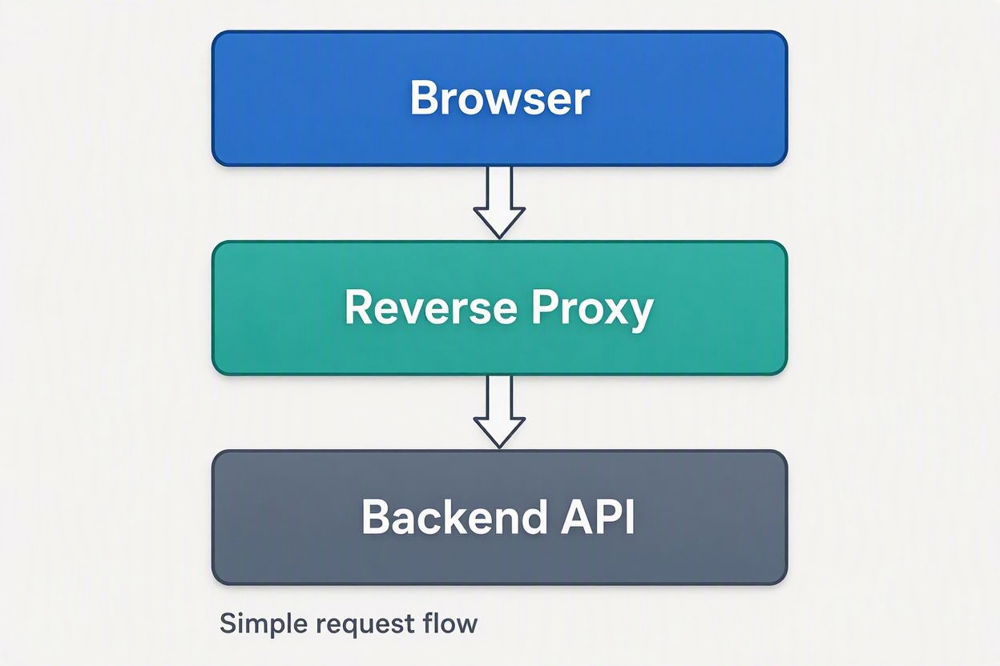

---
id:
title: Docker_Bootcamp
author: Ata Pasha
date: 2026-09-23
keyworks: [ Docker ]
---


Absolutely. I can build you a **Docker Bootcamp from beginner to production-ready**, with hands-on labs and projects.

 ## 🐳 Docker Bootcamp

 **Goal:** By the end, you’ll be able to containerize applications, build images, manage multi-container systems with Docker Compose, and understand the basics of production Docker workflows.

 ### Module 1 — Docker Fundamentals

 - What containers are and why they exist
- Containers vs. virtual machines
- Docker Engine, images, containers, registries
- Installing Docker
- Your first container
- Essential commands:
  - `docker run`
  - `docker ps`
  - `docker stop`
  - `docker rm`
  - `docker logs`
  - `docker exec`
  - `docker inspect`

 **Lab:** Run and interact with an Nginx container.

 ### Module 2 — Docker Images

 - Image layers
- Dockerfiles
- `FROM`, `RUN`, `COPY`, `CMD`, `ENTRYPOINT`
- `.dockerignore`
- Building images
- Tagging images
- Image caching
- Container registries

 **Lab:** Dockerize a simple application.

 ### Module 3 — Networking

 - Container networking fundamentals
- Bridge networks
- Container-to-container communication
- Port publishing
- DNS between containers
- Network isolation

 **Lab:** Connect an application container to a database container.

 ### Module 4 — Persistent Storage

 - Container filesystem
- Volumes
- Bind mounts
- Temporary storage
- Backup/restore concepts

 **Lab:** Run PostgreSQL with persistent data.

 ### Module 5 — Docker Compose

 - `compose.yaml`
- Services
- Networks
- Volumes
- Environment variables
- Dependencies
- Health checks
- Scaling services

 **Lab:** Build a complete:

```
Frontend
   ↓
Backend API
   ↓
PostgreSQL
```

 application using Compose.

 ### Module 6 — Configuration & Secrets

 - Environment variables
- `.env` files
- Configuration patterns
- Secrets
- Avoiding credentials in images
- Development vs. production configuration

 **Lab:** Configure an application without hard-coding credentials.

 ### Module 7 — Production Docker

 - Multi-stage builds
- Smaller images
- Non-root containers
- Health checks
- Resource limits
- Logging
- Restart policies
- Image security
- Container security fundamentals

 **Lab:** Take a development Dockerfile and turn it into a production-oriented image.

 ### Module 8 — Docker Debugging

 You'll learn how to answer questions like:

 > Why does my container immediately exit?

 > Why can't container A reach container B?

 > Why isn't my application seeing my environment variable?

 > Why did my data disappear?

 > Why is my image 1.5 GB?

 We'll use tools such as:

```
docker logs
docker inspect
docker exec
docker stats
docker top
docker network
docker volume
```

 ### Module 9 — CI/CD

 - Building Docker images in CI
- Image tagging strategies
- Registry workflows
- Automated testing
- Push/pull workflows
- Basic deployment concepts

 **Lab:** Create a simple CI pipeline that builds and tests a Docker image.

 ### Module 10 — Final Project 🚀

 Build a production-style application consisting of:

```
                    ┌───────────────┐
                    │    Browser    │
                    └───────┬───────┘
                            │
                     ┌──────▼──────┐
                     │   Reverse   │
                     │    Proxy    │
                     └──────┬──────┘
                            │
                     ┌──────▼──────┐
                     │   Backend   │
                     │     API     │
                     └──────┬──────┘
                            │
                     ┌──────▼──────┐
                     │ PostgreSQL  │
                     └─────────────┘
```

 You'll create:

 - Dockerfiles
- Custom networks
- Persistent volumes
- Environment configuration
- Health checks
- Multi-stage builds
- Docker Compose configuration
- Production-oriented containers
- CI/CD pipeline

 ## 🎓 How I'd structure each lesson

 Every lesson can follow this format:

 **1\. Concept**\
 Short explanation of the theory.

 **2\. Commands**\
 The Docker commands you need to know.

 **3\. Demonstration**\
 A realistic example.

 **4\. Hands-on lab**\
 You perform the task yourself.

 **5\. Troubleshooting**\
 We deliberately break something and fix it.

 **6\. Challenge**\
 A task without the solution immediately given.

 **7\. Quiz**\
 A few questions to verify that you've understood the material.

---

 ### Prerequisites

 You don't need to be a Docker expert. Ideally, you should have:

 - Basic command-line knowledge
- Basic Linux concepts
- Some programming experience
- A computer where Docker can be installed

 You **don't need to know Kubernetes** to start.

 If you'd like, I can also turn this into a **complete 7-day Docker Bootcamp**, where I act as your instructor and give you **Day 1 → lesson → exercises → homework → quiz → Day 2**, progressively increasing the difficulty.
